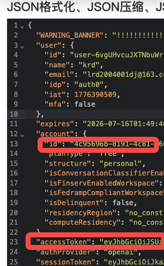

# 介绍
- 实现了openai codex 接口转发，支持多账号额度调度，5小时额度低于3%会自动切换新账号
- 并且实现了messages api和responses api的翻译，可以让claude code 使用gpt-5.4
## 配置
- npm install


- token
```
{
  "type":"token",
  "proxy_port":7890,
  "port":3000,
  "configs":[
      {
        "access_token": "",
        "account_id": "",
        "description": ""
      }
    ]
}

```
- access_token 和 account_id 获取  
登录gpt plus后打开：https://chatgpt.com/api/auth/session
取以下值配置上去，有效时间是3个月


!注意不要退出登录,退出登录token就失效了
- proxy_port 填本地的代理端口
- port 填服务监听端口，不填时默认 `3000`
## 启动
```
bash run.sh
bash run.sh stop
```

使用 `bash run.sh` 可以避开脚本可执行权限问题。

## ccs配置
使用ccs配置转发到对应地址就可以，apikey随便写。也可以自己手动配置


