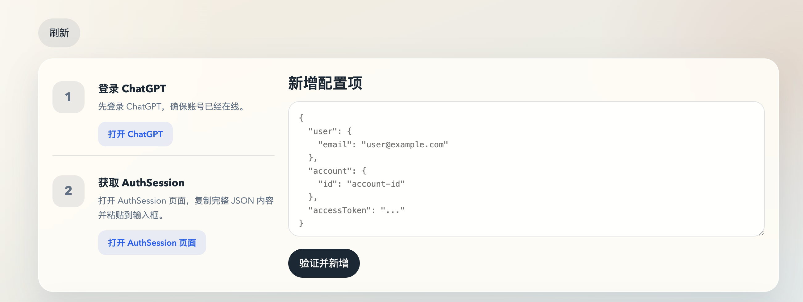

# 介绍
- 实现了openai codex 接口转发，支持多账号额度调度，5小时额度低于3%会自动切换新账号
- 并且实现了messages api和responses api的翻译，可以让claude code 使用gpt-5.4
## 配置
- npm install
- 可以先复制 [openai.json.example](./openai.json.example) 为 `openai.json`
- `apikeys` 为可选入口密钥数组；只要数组非空，请求就必须携带其中任意一个 `apikey`
- `auth_token` 用于管理后台访问；留空或缺失时，启动后会自动生成并写回配置文件
- proxy_port 填本地的代理端口
- port 填服务监听端口，不填时默认 `3009`
## 启动
``` 
bash run.sh
bash run.sh stop
bash run.sh logs
```

## 配置账号
启动后访问启动日志里打印的管理地址，例如 `http://127.0.0.1:3009/admin/configs?auth_token=...`

管理页里可以新增随机 `apikey`，也可以删除已有 `apikey`
执行以下curl,有正常内容返回，就表示airouter已经成功配置
!注意不要退出登录,退出登录token就失效了，建议在无痕窗口登录gpt后获取登录态
如果你配置了入口 `apikeys`，记得额外加上 `-H "Authorization: Bearer <apikey>"`

```
curl http://127.0.0.1:3009/v1/responses \
-H "Content-Type: application/json" \
-d '{"model":"gpt-5.4","input":[{"type":"message","role":"user","content":[{"type":"input_text","text":"hello"}]}]}'
```
## ccs配置
建议使用 https://github.com/farion1231/cc-switch 管理本地的配置
使用 ccs 配置转发到对应地址即可；如果 airouter 配置了入口 `apikeys`，这里填其中任意一个值，否则可以留空或随便写。也可以自己手动配置


