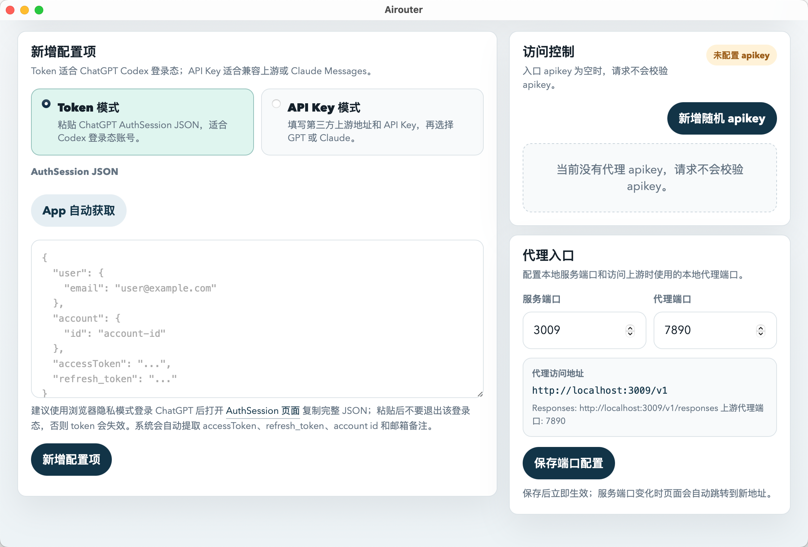

# Airouter

Airouter 是一个本地 API 转发服务。

你可以把 ChatGPT/Codex 登录态、OpenAI 兼容 API、Claude Messages 兼容 API 放进 Airouter，然后让 Codex、Claude Code、cc-switch 等工具统一访问一个本地地址：

```text
http://localhost:3009/v1
```

Airouter 会在本机转发请求，并在账号不可用时自动切换到其他可用账号。

## 安装和启动

在项目目录里安装依赖并启动服务：

```bash
npm install
npm start
```

服务会在本机启动，默认端口是 `3009`。管理页面地址会写入日志，可以用下面的命令查看：

```bash
npm run logs
```

## 第一次使用

第一次启动时，如果项目目录里还没有 `openai.json`，命令行会进入配置引导：

1. 服务端口：默认 `3009`，一般不用改。
2. 本地代理端口：如果你访问 ChatGPT 需要代理，常见填 `7890`；不需要可以留空。
3. 入口 apikey：可选。开启后，客户端访问 Airouter 时需要带这个 apikey。

完成后访问日志里显示的管理页面。


## 添加账号

管理页面里主要添加两类账号。

### ChatGPT/Codex 账号

适合使用 ChatGPT/Codex 账号额度。

打开 `https://chatgpt.com/api/auth/session` 获取 AuthSession JSON，复制完整 JSON，粘贴到 `AuthSession JSON` 文本框，然后点击 `新增配置项`。

注意：

- 请复制完整 JSON，不要只复制 `accessToken`。
- 登录态添加成功后，不要主动退出这个 ChatGPT 登录态，否则 token 可能失效。

### 第三方 API Key

适合接入 OpenAI 兼容接口或 Claude Messages 兼容接口。

选择 `API Key 模式`，填写：

- `Base URL`：上游地址，通常写到 `/v1`，例如 `https://api.example.com/v1`。
- `API Key`：上游服务提供的 key。
- `支持类型`：
  - `GPT`：支持 OpenAI 兼容接口，也可作为 `/v1/messages` 的 Responses 转换上游。
  - `Claude`：支持 Claude Messages 原样转发接口。

填完后点击 `新增配置项`。

## 给客户端使用

管理页面会显示代理地址，通常是：

```text
http://localhost:3009/v1
```

常用接口：

```text
http://localhost:3009/v1/responses
http://localhost:3009/v1/images/generations
http://localhost:3009/v1/images/edits
http://localhost:3009/v1/messages
```

完整接口说明见 [API 接口文档](docs/api-reference.md)。

Token 配置下，`/v1/images/generations` 和 `/v1/images/edits` 会通过 Codex Responses 的 `image_generation` 工具兼容输出 OpenAI Images JSON：

```json
{
  "created": 1779778600,
  "data": [
    {
      "b64_json": "...",
      "revised_prompt": "..."
    }
  ]
}
```

如果页面里配置了入口 `apikey`，客户端里还要填同一个 `apikey`：

```http
Authorization: Bearer sk-airouter-xxxx
```

如果没有配置入口 apikey，本机请求不会校验 apikey。

## 配合 cc-switch

推荐用 [cc-switch](https://github.com/farion1231/cc-switch) 管理 Codex、Claude Code 等客户端配置。

在 cc-switch 里填写：

```text
Base URL: http://localhost:3009/v1
API Key: 管理页里的入口 apikey，没有配置就留空
```

示例：


## 账号顺序和自动切换

Airouter 会对 ChatGPT/Codex token 账号做会话粘性调度。相同 `session_id`、`conversation_id`、`thread_id`、`previous_response_id`，或请求头里的 `x-airouter-session-id` / `x-client-request-id`，会通过 HRW/Rendezvous 一致性哈希尽量固定到同一个可用 token 账号。

你可以：

- 用 `置顶` 调整优先级。
- 在 token 行用 `设为锚点` 指定 token 并发池的调度焦点。
- 在 apikey 行用 `全量切换` 进入 API Key 覆盖模式。
- 用 `停用` 将账号移入停用列表。停用账号对服务不可见，后续请求、额度刷新和 fallback 都不会读取它，但可以在管理页重新启用。
- 用 `删除` 永久移除不再需要的账号。

token 账号不可用时，同一会话会自动漂移到其他可用 token 账号；没有会话标识的 token 请求会按当前 in-flight 数分摊。`apikey` 上游不参与这套并发调度，只有 token 不可用时才作为传统 fallback。Airouter 会自动检查 ChatGPT/Codex token 账号状态；额度低、登录态失效或账号不可用时，会跳过它。额度检查本身连续 3 次失败才会把 token 标记为 `quota_check_failed`，成功检查会清零失败计数。apikey 直连上游会记录最近 30 分钟内最多 10 个已完成真实请求，401/403、429、5xx、请求失败或响应体中断累计达到 3 次时，会被临时标记为不可用并尝试切换。已被标记为不可用的 GPT apikey 会在每 10 分钟全量校正中用 `/v1/responses` 的 `hello` 请求探测，成功后自动恢复可用；探测模型默认 `gpt-5.5`，可在 apikey 配置里用 `"health": {"model": "gpt-4.1-mini"}` 覆盖。

管理页会在“调度模式”和 token 账号摘要里显示安全的调度观测：正在请求时显示 `当前会话 #短hash -> 配置 #N`，请求结束后保留 `最近会话 #短hash`，用于观察某个会话实际命中了哪个账号。原始会话 ID 不会写入配置，也不会返回到页面。

管理页也会在账号摘要中显示最近一次 `/v1/responses` 或 `/v1/messages` 转换链路的模型观测，例如 `响应模型 gpt-5.4-mini · 请求 gpt-5.5`，方便判断上游实际返回的模型是否符合预期。

`/v1/messages` 会优先使用支持 `Claude` 的 API Key 原样转发；没有可用 Claude 上游时，先使用 token 做兼容转换，token 不可用时可使用支持 `GPT` 的 API Key 做同样的 Responses 转换。

## 端口说明

管理页可以修改两个端口：

- 服务端口：Airouter 对外提供接口的端口，默认 `3009`。
- 本地代理端口：Airouter 访问上游时使用的代理端口，例如 `7890`。

保存端口后会立即生效。服务端口变化时，页面会自动跳转到新地址。

## 常见问题

### 管理页面打不开

先确认服务正在运行：

```bash
npm start
npm run logs
```

### 提示 auth_token 无效

管理页面地址里的 `auth_token` 不对。请使用日志里显示的完整管理页面地址，不要手动删改 URL 后面的参数。

### 请求返回 401 或 token_revoked

通常是 ChatGPT 登录态失效。重新获取 AuthSession JSON 后添加新的配置项。

### API Key 有两种，怎么区分

- 上游 API Key：填在 `API Key 模式`里，Airouter 用它访问上游。
- 入口 apikey：填在客户端里，客户端用它访问 Airouter。

## 常用命令

```bash
npm start        # 启动
npm run stop     # 停止
npm run restart  # 重启
npm run logs     # 查看日志
```

服务会使用项目目录下的 `openai.json`。
